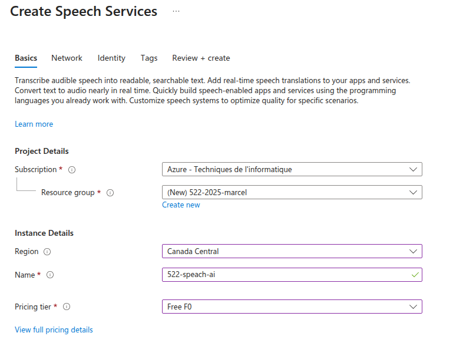
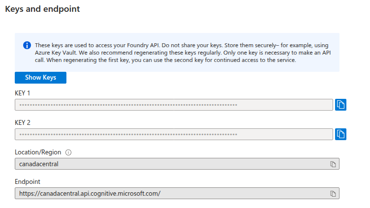

## Étapes générales :

1. **Créer votre service Speech sur Azure IA**
2. **Ajouter les dépendances nécessaires dans le fichier `pubspec.yaml`.**
3. **Ajouter les permissions nécessaires**
4. **Implémenter la fonctionnalité d'enregistrement audio.**
5. **Envoyer l'audio à l'API Speech de Azure après l'enregistrement.**

***


### 1. Créer votre service Speech sur Azure IA

* Se connecter à Azure
* Créer un service "**Services de reconnaissance vocale**"
  * L'important est de sélectionner le **Prix "Free F0"**.




* Lorsque la création est terminée, vous aurez à récupérer la clé 1 et l'emplacement (région).
  * Il y a 2 clés, mais on n'a besoin que de la première.




***


### 2. Ajouter les dépendances nécessaires

Dans votre fichier `pubspec.yaml`, ajoutez les dépendances suivantes :

```yaml
dependencies:
  flutter:
    sdk: flutter
  record: ^6.1.2
  http: ^1.6.0
  path_provider: ^2.1.5
  uuid: ^4.5.2
```

Puis exécutez :

```bash
flutter pub get
```

---


### 3. Ajouter les permissions nécessaires

**Pour Android** : dans `android/app/src/profile/AndroidManifest.xml`, ajoutez :

```xml
<uses-permission android:name="android.permission.RECORD_AUDIO"/>
<uses-permission android:name="android.permission.INTERNET"/>
```

**Pour iOS** : dans `ios/Runner/Info.plist`, ajoutez :

```xml
<key>NSMicrophoneUsageDescription</key>
<string>Cette application nécessite l'accès au microphone pour enregistrer votre voix.</string>
<key>NSAppTransportSecurity</key>
<dict>
    <key>NSAllowsArbitraryLoads</key>
    <true/>
</dict>
```

---


### 4. Implémenter la fonctionnalité d'enregistrement audio

Voici le code implémentant l'enregistrement de l'audio :

> S'il y a problème avec l'enregistrement, c'est probablement à cause de vos permissions (point précédent), ou du dossier temporaire qui est en problème.  Si c'est le cas, un peu de recherche sur internet devrait vous aider à trouver la solution. :)

```dart
final _record = Record();
bool _isRecording = false;

Future<void> _startRecording() async {
    bool hasPermission = await _record.hasPermission();
    if (hasPermission) {
        Directory tempDir = await getTemporaryDirectory();
        String path = '${tempDir.path}/voice.wav';
        await _record.start(
        path: path,
        encoder: AudioEncoder.wav,
        bitRate: 16000,
        samplingRate: 16000,
        );
        setState(() {
        _isRecording = true;
        });
    }
}

Future<void> _stopRecording() async {
    String? path = await _record.stop();
    setState(() { _isRecording = false; });
    if (path != null) {
        File audioFile = File(path);
        await _sendAudioToAzure(audioFile);
    }
}
```

---


### 5. Envoyer l'audio à l'API Speech de Azure

Pour réaliser l'appel à l'API du service, vous devez :

* Convertir votre fichier audio en bytes.
* Envoyer votre requête d'API via POST
  * **URL** : `https://{votre_region}.stt.speech.microsoft.com/speech/recognition/conversation/cognitiveservices/v1?language=fr-CA`
    * Remplacer `{region}` par la région de votre service (ex.: `canadacentral`)
  * **Paramètres de l'entête** :
    * votre clé d'API : `'Ocp-Apim-Subscription-Key': 'votre_clé_API'`
    * le format du fichier audio : `'Content-Type': 'audio/wav; codecs=audio/pcm; samplerate=16000'`
  * **Le contenu de la requête (body)** : votre fichier audio en bytes.
* Le résultat va être dans la variable `DisplayText` de la réponse, en supposant que le code de retour est bien 200.
